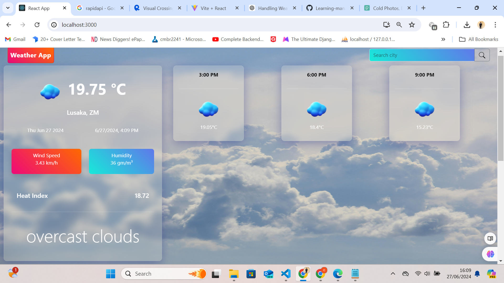
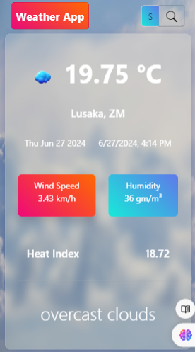
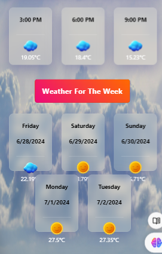

# Weather Application

## Overview

This is a weather application that displays current weather information and forecasts for a chosen city.

## Setup Steps

To run this application locally, follow these steps:

1. **Clone the repository:**

   ```bash
   git clone "https://github.com/Cathbert-Busiku/weather-app.git"

   ```

2. **nstall dependencies::**

   cd weather-app # Navigate to the project directory
   npm install

3. **Set up environment variables::**

   Create a .env file in the root directory.
   Add your OpenWeatherMap API key in the .env file:
  
   Copy code
   
    ```bash
        REACT_APP_WEATHER_API_KEY=your-api-key-here
    ```

4. **Run the application:**


   ```bash 
   npm start 
   ```

### APP Screenshots

1. **Desktop View**: 
   

2. **Mobile View 1**: 
   
   

